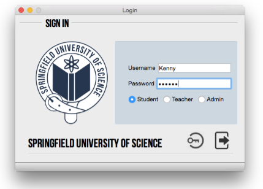

# score-system
A mock university student administration system for scoring and results

<h2>Instruction</h2>
This project requires building in Qt. First change database users.db path and the file output path in viewstudent.cpp and studentpage.cpp accordingly, then build the project. The program is preferred to run on MacOS for best results.

<h2>Preview</h2>
<strong>Login Page</strong>

